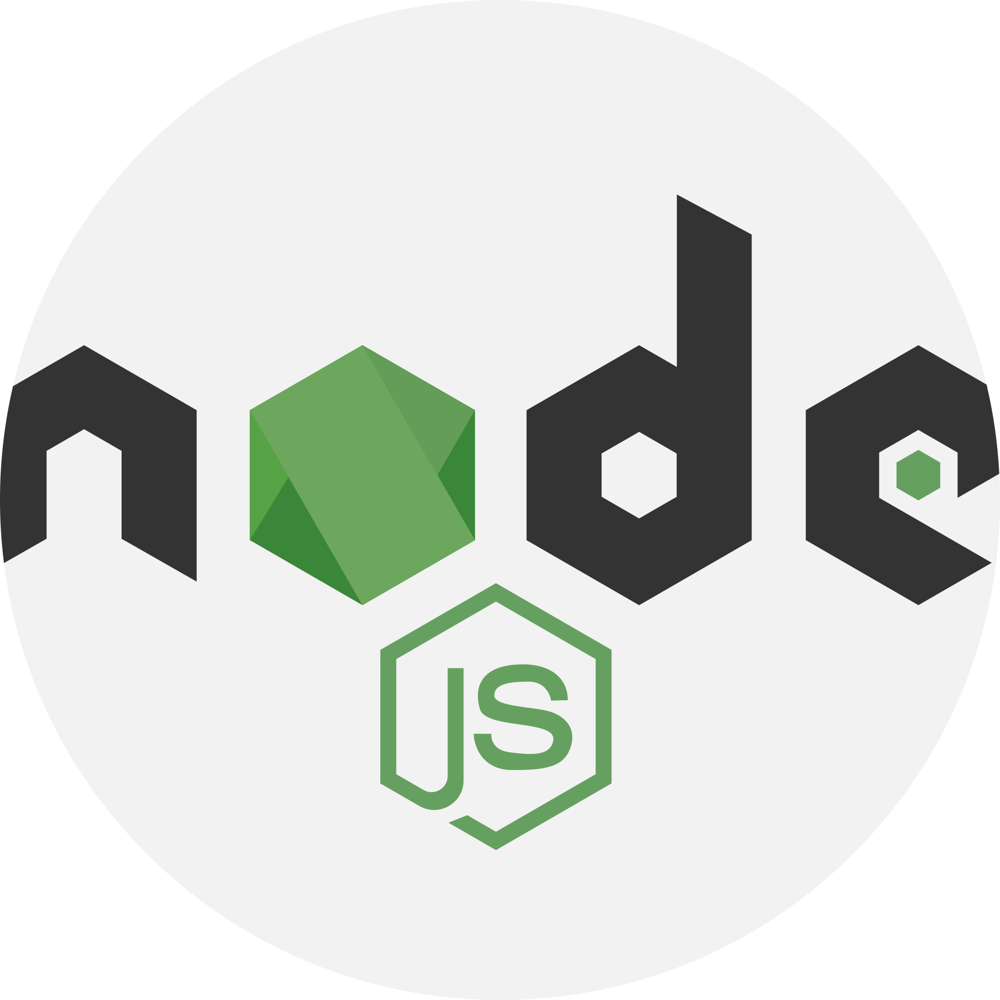
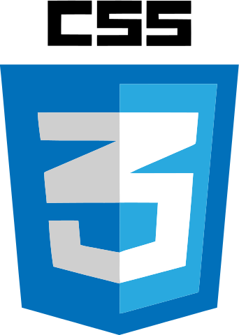
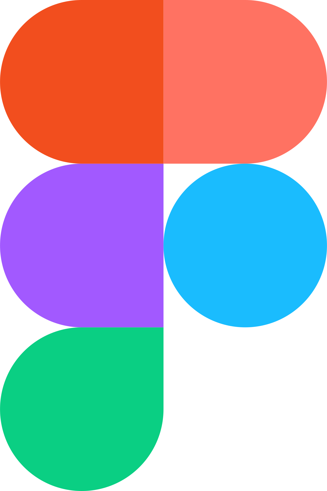
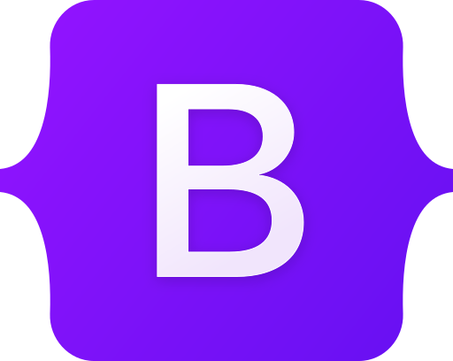
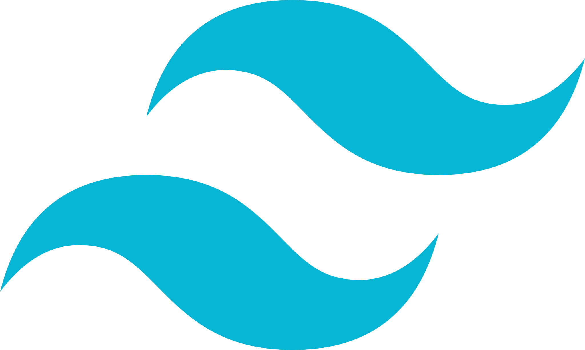
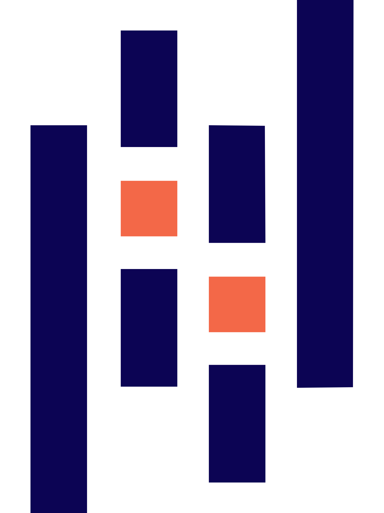
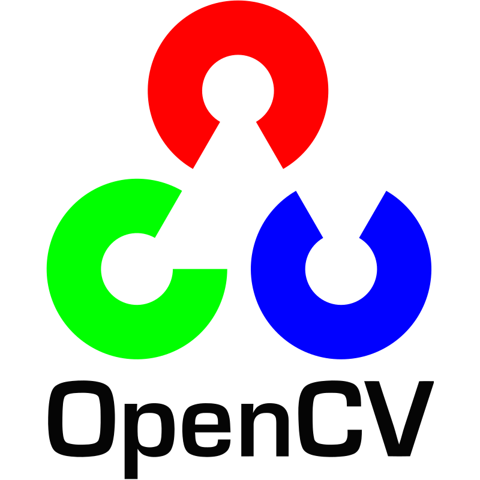

<h1 align="center">Olá, eu sou Vinicius Costa</h1>
<h3 align="center">Um Cientista de dados em busca de insights 📊</h3>

  

 
- 💻​ Atualmente sou Engenheiro de Machine Learning na Aprix, gerando estudos de IA e DevOps em uma empresa focada **Precificação Inteligente**

- 🔎 Fui bolsista da UFC na pesquisa: **Reconhecimento de cistos odontologicos em imagens de radiografia panorâmica**

- 📚 Focando meus estudos no momento em **IaC, Big Data, e pipelines**

<h2 align="center">🔥 Linguagens | Frameworks | Ferramentas | Habilidades 🔥</h2>
 

  <code></code>
  <code></code>
  <code></code>
  <code></code>
  <code></code>
  <code></code>
  <code></code>
  <code></code>
  <code></code>
  <code></code>
  <code></code>
  <code></code>
  <code></code>
  <code></code>
  <code></code>
  <code></code>
  <code></code>
  <code></code>
  <code></code>
  <code></code>
  <code></code>
  <code></code>
  <code></code>
  <code></code>
  <code></code>
  <code></code>
  <code></code>

<!-- REDES SOCIAIS -->

  
    
